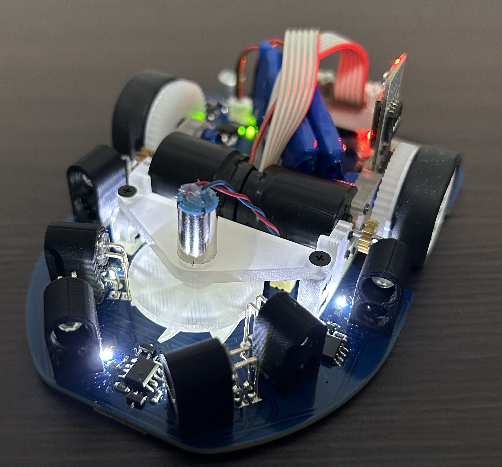

# Mercury-v2-firmware

### クラシックマウス1号機 Mercury v2 (2024/08~)
<div style="text-align: center;">
    
</div>

## 1. Development Environment
- Ubuntu 22.04
- gcc 11.4.0
- GNU Make 4.3
<!-- - doxygen 1.8.17 -->

## 2. Submodules (Fork)
- [MazeSolver2015](https://github.com/idt12312/MazeSolver2015)：マイクロマウスの迷路探索&走行経路ライブラリ
- [micromouse-control-module](https://github.com/kerikun11/micromouse-control-module)：マイクロマウス車体制御モジュール

## 3. Doxygen
```
doxygen
xdg-open docs/html/index.html
```
`docs/html/index.html`にリファレンスが生成される． 